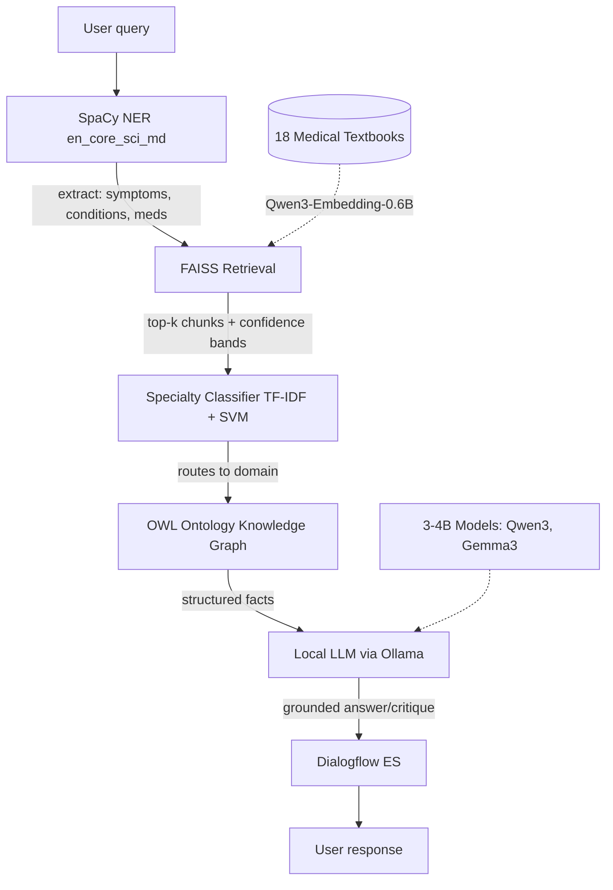

# EMMA — Emergency Medicine Mentoring Agent

## 1. Overview

EMMA is a conversational medical study agent for medical students. It has two modes:

1. Explain / Q&A Mode

   Ask any medical question; EMMA retrieves relevant passages from 18 medical textbooks and generates a grounded answer via a local LLM

2. Quiz Mode

   Ask EMMA to quiz you on a topic; it serves a real USMLE question from MedQA, takes your answer conversationally, and critiques it with reference to the correct answer and supporting textbook evidence

The central research question is:

> Does textbook-grounded RAG improve small LLM accuracy on MedQA/MedMCQA compared to a baseline without retrieval?

Results are benchmarked against AMG-RAG's published scores of 74.1% F1 / 66.34% accuracy on the same datasets. All inference runs locally via Ollama, with no OpenAI API, no cloud LLM calls.

## 2. Architecture



## 3. Data

| #   | Source                                         | Role                                                             | Size                            |
| --- | ---------------------------------------------- | ---------------------------------------------------------------- | ------------------------------- |
| 1   | [MedQA USMLE](https://github.com/jind11/MedQA) | Quiz question bank + evaluation + RAG knowledge base (textbooks) | 12,723 questions + 18 textbooks |
| 2   | [MedMCQA](https://github.com/MedMCQA/MedMCQA)  | Classifier training                                              | 182,822 labelled questions      |

MedQA USMLE ships with two components: the questions themselves (used for quiz mode and evaluation) and 18 plain-text medical textbooks (used as the RAG retrieval corpus). The textbooks are the literal source material that USMLE questions were written from, making them the ideal retrieval corpus. MedMCQA is used for classifier training only — its `subject_name` labels provide the specialty ground truth that MedQA lacks.

Data lives in `data/` (committed to git).

# What's Done

## 4. Data loaders

### 4.1. Relevant files

- `src/data.py` — data loading functions

Unified loaders for all three data sources. Auto-detects the repo root from `pyproject.toml`.

```python
from src.data import load_medqa, load_medmcqa, load_all_textbooks
df    = load_medqa(split='train')   # 10,178 rows
books = load_all_textbooks()        # dict of 18 textbooks
```

## 5. FAISS vectorstore

### 5.1. Relevant files

- `src/vectorstore.py` — embedding + FAISS index functions
- `notebooks/01_vectorstore_build.ipynb` — builds the vectorstore from textbooks

Chunks 18 textbooks -> embeds with Qwen3-Embedding-0.6B -> builds FAISS IndexFlatIP -> saves to disk. Build runs on Colab T4 GPU (~60 min); all subsequent usage loads in under 1 second on CPU.

### 5.2. Embedding Model

[Qwen3-Embedding-0.6B](https://huggingface.co/Qwen/Qwen3-Embedding-0.6B) was selected for three reasons:

1. Family Performance

   The Qwen3 Embedding family's 8B variant ranks #6 on RTEB Healthcare with a score of 67.03 (April 2026) and #1 on MTEB Multilingual (score 70.58, June 2025) among open-source models.

2. GPU Budget

   At 0.6B parameters (~1.2GB in float16), it fits on a Colab T4 GPU. The 8B variant requires ~16GB VRAM, which is unavailable on free-tier hardware.

3. Context Window

   32K tokens eliminates chunking boundary issues for long textbook passages.

> [!NOTE]
> `Qwen3-Embedding-0.6B` has not been independently evaluated on RTEB Healthcare. The closest evaluated model at the same parameter scale is `jina-embeddings-v5-text-small` (also 0.44B, RTEB Healthcare score 62.35, rank 16). A known limitation of this project is that a direct healthcare retrieval benchmark comparison for the 0.6B model is not available.

### 5.3. Index

36,723 vectors at 1024 dimensions, 143 MB on disk.

### 5.4. Retrieval Quality Observed

| #   | Query type                           | Score range        | Books surfacing                  |
| --- | ------------------------------------ | ------------------ | -------------------------------- |
| 1   | Direct question (e.g. anaphylaxis)   | 0.72-0.73 (high)   | Harrison's, Nelson Pediatrics    |
| 2   | Direct question (e.g. beta blockers) | 0.72-0.73 (high)   | Harrison's, Katzung Pharmacology |
| 3   | Clinical vignette (inferior STEMI)   | 0.63-0.66 (medium) | Harrison's, First Aid Step 2     |

Clinical vignettes score lower because incidental language ("58-year-old man", "presents with") dilutes the embedding. The RAG pipeline handles this by running NER first and querying with extracted clinical entities.

### 5.5. Confidence Bands

Confidence bands used downstream:

- `high` >= 0.70 — use freely
- `medium` >= 0.55 — flag to LLM as uncertain
- `low` >= 0.40 — include cautiously
- `very_low` < 0.40 — filtered out by default

```python
from src.vectorstore import load_index_with_texts, load_embedding_model, search
index, metadata, texts = load_index_with_texts()
model   = load_embedding_model()
results = search("mechanism of septic shock", index, metadata, texts, model, k=5)
# each result: {rank, score, confidence, book, friendly_name, chunk_idx, text}
```

## 6. Specialty Classifier

### 6.1. Relevant files

- `src/classify.py` — classification functions
- `notebooks/02_classification.ipynb` — trains and evaluates the specialty classifier

Trains on MedMCQA (179,777 questions, 19 specialties) and applies to MedQA (12,723 questions) to produce specialty routing tags for the RAG pipeline. Follows A1 methodology: full feature x classifier grid, 10-fold stratified CV, weighted F1 + Cohen's kappa.

### 6.2. Corpus characterisation

Mean inter-category TF-IDF cosine similarity = **0.72** on MedMCQA vs ~0.95 on the A1 PubMed AI corpus. Lower overlap makes this a more tractable classification task.

### 6.3. Grid Results (Stratified 20k CV Sample)

| #   | Configuration              | CV Weighted F1        | CV Cohen's kappa      |
| --- | -------------------------- | --------------------- | --------------------- |
| 1   | TF-IDF Bigrams + LinearSVC | **0.5424 +/- 0.0086** | **0.5089 +/- 0.0096** |
| 2   | BOW + LinearSVC            | 0.5042 +/- 0.0100     | 0.4683 +/- 0.0109     |
| 3   | MiniLM-L6-v2 + LinearSVC   | 0.4635 +/- 0.0254     | 0.4297 +/- 0.0268     |
| 4   | BOW + MNB                  | 0.4590 +/- 0.0084     | 0.4294 +/- 0.0089     |

TF-IDF Bigrams + LinearSVC is the champion, which is consistent with A1's finding. The CV uses a 20k sample for model selection; the champion is retrained on all 179,777 questions.

### 6.4. Full-Corpus Holdout Performance

- Weighted F1 = 0.69
- Cohen's kappa = 0.66

The CV-to-holdout gap (0.54 -> 0.69) is expected from 9x more training data and is not a data leakage issue.

### 6.5. Comparison to A1

A1 achieved 0.681 F1 on 5 classes (0.95 similarity). We achieve 0.69 on 19 classes (0.72 similarity), which is a harder problem at comparable performance, supporting the generalisation hypothesis.

### 6.6. Notable confusion pairs

| #   | True Specialty | Predicted Specialty | % of true specialty questions | Clinical rationale                     |
| --- | -------------- | ------------------- | ----------------------------- | -------------------------------------- |
| 1   | Dermatology    | Dental              | 34%                           | shared tissue vocabulary               |
| 2   | Orthopaedics   | Surgery             | 19%                           | clinically adjacent                    |
| 3   | Pathology      | Internal Medicine   | 13%                           | overlapping disease mechanism language |

## 7. Topic Clustering

### 7.1. Relevant files

- `src/cluster.py` — clustering functions
- `notebooks/03_clustering.ipynb` — BERTopic clustering and evaluation against A2 baselines.

Applies BERTopic to discover latent topic structure in MedQA questions. Evaluates against A2 baseline methods using the three A2 metrics: Cohen's kappa, Silhouette score, Topic Coherence C_v.

### 7.2. Setup

12,723 MedQA questions embedded with MiniLM-L6-v2. Specialty labels from notebook 02 used as ground truth for kappa evaluation.

### 7.3. Results

| #   | Method                              | K   | Outliers    | Cohen's kappa | Silhouette | C_v Coherence |
| --- | ----------------------------------- | --- | ----------- | ------------- | ---------- | ------------- |
| 1   | TF-IDF + LSA + GMM (A2 baseline)    | 19  | 0 (0%)      | 0.014         | --         | --            |
| 2   | Embeddings + Spectral (A2 baseline) | 19  | 0 (0%)      | 0.024         | 0.064      | --            |
| 3   | BERTopic (automatic K)              | 39  | 4,617 (36%) | -0.020        | 0.072      | **0.475**     |

### 7.4. Interpretations

1. Near-Zero Kappa

   Kappa here measures agreement between discovered cluster IDs and 19 specialty labels. Low kappa indicates that BERTopic found 39 finer-grained topic groups that do not align with the 19 specialty boundaries. This is expected: the topics are more granular than the labels. Topic 0 (chest/cardiac terms) is 70.6% Internal Medicine; Topic 4 (gestation/pregnancy) is 72.4% Obstetrics, which is clinically sensible, just below the specialty level of granularity.

   The A2 baselines also show near-zero kappa on this corpus. The gap to A2's reference kappa of 0.418 is fully explained by corpus differences: A2 used 5 balanced classes with long abstracts at 0.95 similarity; here we have 19 imbalanced classes with 20-word questions at 0.72 similarity. This is a documented finding, not a methodology failure.

2. Topic Coherence $C_v = 0.475$

   This confirms the topic word representations are internally coherent even where they don't align with specialty labels.

3. Outlier Rate = 36%

   This reflects the short question stem length (~20 words). BERTopic's HDBSCAN component requires sufficient text density. Outlier questions (-1 topic) fall back to specialty-only routing in the RAG pipeline, with no questions dropped.

The 39 topic assignments provide finer-grained routing than specialty labels. A question in Internal Medicine that belongs to topic 0 (chest/cardiac) retrieves from cardiology-relevant textbook chunks rather than the full Internal Medicine retrieval pool.

# What's Next

## 8. RAG Pipeline

### 8.1. Relevant files

-`notebooks/04_rag_pipeline.ipynb`

Wire up SpaCy NER -> FAISS retrieval -> OWL ontology -> prompt construction -> local LLM. Compare answers with and without RAG on a set of MedQA questions. Low-confidence retrievals flagged in prompt.

## 9. Quiz Mode

### 9.1. Relevant files

-`notebooks/05_quiz_mode.ipynb`

Conversational quiz: serve MedQA question, accept free-text answer, generate textbook-grounded critique. Includes Surprise SVD recommender tracking user performance by specialty.

## 10. Evaluation Benchmark

### 10.1. Relevant files

- `notebooks/06_evaluation_benchmark.ipynb`

Benchmark 3-4 Ollama models on 100 MedQA questions with and without RAG. Primary metric: 4-option accuracy. Compare to AMG-RAG's 66.34% baseline.

## 11. FastAPI Webhook

### 11.1. Relevant files

- `src/api.py`

FastAPI webhook for Dialogflow ES. Routes intent + entity payloads through the EMMA pipeline.

## 12. Setup

### 12.1. Prerequisites

- Python 3.11+, [uv](https://github.com/astral-sh/uv), [Ollama](https://ollama.com) (notebooks 04+)

### 12.2. Install

```bash
git clone https://github.com/jaxendutta/emma.git
cd emma
bash scripts/setup.sh      # Unix / WSL
scripts\setup.ps1          # Windows PowerShell
```

### 12.3. Vectorstore

Pre-built files (too large for git) — download from the shared Google Drive folder and place in `models/vectorstore/`. Run the auto-download cell in notebook 01 section 4. Or rebuild from scratch via notebook 01 on Colab T4 (~60 min).

## 13. Key Design Decisions

| #   | Decision                          | Rationale                                                                                                                                                                                                |
| --- | --------------------------------- | -------------------------------------------------------------------------------------------------------------------------------------------------------------------------------------------------------- |
| 1   | Textbooks as RAG corpus           | MedQA questions were written from these 18 textbooks, making them the ideal retrieval source. Faster and more reproducible than live PubMed querying.                                                    |
| 2   | Qwen3-Embedding-0.6B              | #1 open-source MTEB embedder (June 2025), 32K context, Apache 2.0. Float16 on GPU halves VRAM with no quality loss.                                                                                      |
| 3   | Local LLMs via Ollama             | no API costs; model selector is a direct evaluation apparatus for the LLM scale research question.                                                                                                       |
| 4   | Separation of concerns            | the ML pipeline makes routing decisions; the LLM generates explanations only. Safety-critical routing is deterministic and auditable.                                                                    |
| 5   | Data-driven subject normalisation | specialty labels are built from the actual `subject_name` column at runtime. Only deliberate collapse rules (e.g. `"Medicine"` -> `"Internal Medicine"`) are hardcoded.                                  |
| 6   | Stratified CV subsampling         | 20k stratified sample for model selection (sufficient to rank configurations); champion retrained on full 179k corpus. Documented explicitly to avoid misinterpreting the CV-to-holdout performance gap. |
| 7   | Score thresholding                | chunks below 0.40 filtered; 0.40-0.70 carry a confidence flag for LLM hedging. NER-based query rewriting handles clinical vignette scoring.                                                              |
