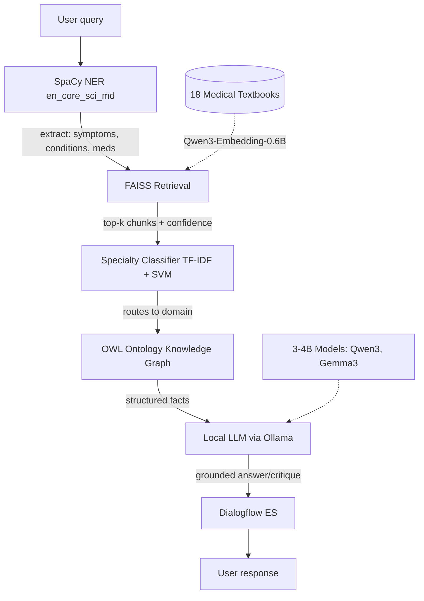

# EMMA — Emergency Medicine Mentoring Agent

## What's EMMA

EMMA is a conversational medical study agent for medical students. It has two modes:

- **Explain / Q&A mode** — ask any medical question; EMMA retrieves relevant passages from 18 medical textbooks and generates a grounded answer via a local LLM
- **Quiz mode** — ask EMMA to quiz you on a topic; it serves a real USMLE question from MedQA, takes your answer conversationally, and critiques it with reference to the correct answer and supporting textbook evidence

The central research question is: **does textbook-grounded RAG improve small LLM accuracy on MedQA/MedMCQA compared to a baseline without retrieval?** Results are benchmarked against AMG-RAG's published scores of 74.1% F1 / 66.34% accuracy on the same datasets.

All inference runs locally via Ollama — no OpenAI API, no cloud LLM calls.

## Architecture



Each component maps directly to a course module:

| Component              | Course week    | Method                                          |
| ---------------------- | -------------- | ----------------------------------------------- |
| SpaCy NER              | Week 7         | `en_core_sci_md` biomedical model               |
| FAISS retrieval        | Week 7         | Sentence-BERT / Qwen3-Embedding                 |
| Specialty classifier   | A1 methodology | TF-IDF + Linear SVM                             |
| BERTopic clustering    | Week 7         | MedQA question clustering by specialty          |
| Knowledge graph        | Week 7         | OWL ontology + NetworkX                         |
| Dialogflow fulfillment | Week 8         | FastAPI webhook backend                         |
| Recommender system     | Week 12        | Surprise SVD on user × topic interaction matrix |

## Data

| Source                   | Role                            | Size                              |
| ------------------------ | ------------------------------- | --------------------------------- |
| **18 Medical Textbooks** | RAG knowledge base              | ~87M chars, 36,723 chunks         |
| **MedQA USMLE**          | Quiz question bank + evaluation | 12,723 questions (train/dev/test) |
| **MedMCQA**              | Evaluation benchmark            | 193,155 questions                 |

The textbooks are the literal source material that USMLE questions were written from — making them the ideal retrieval corpus. MedQA and MedMCQA are used for evaluation only, not training.

Data lives in `data/` (not committed to git — too large). See setup instructions below.

## What's Done

- `src/data.py` — Data loaders

    Unified loaders for all three data sources. Auto-detects the repo root from `pyproject.toml` so paths work regardless of working directory.

    ```python
    from src.data import load_medqa, load_medmcqa, load_all_textbooks
    df = load_medqa(split='train')        # 10,178 rows
    books = load_all_textbooks()          # dict of 18 textbooks
    ```

- `src/vectorstore.py` — FAISS vectorstore
   
    Full pipeline: chunk 18 textbooks → embed with Qwen3-Embedding-0.6B → build FAISS index → persist to disk. Includes score thresholding and confidence bands on retrieval.

    **Embedding model:** `Qwen/Qwen3-Embedding-0.6B` — #1 open-source embedding model on MTEB multilingual leaderboard (score 70.58, June 2025). Apache 2.0, 32K token context, 1024-dim embeddings. Loaded in float16 on GPU to halve VRAM usage.

    **Index:** FAISS `IndexFlatIP` (exact cosine similarity). 36,723 vectors at 1024 dimensions. Build time ~60 min on Colab T4 GPU.

    **Retrieval quality:** Score bands calibrated from observed results:
    - `high` ≥ 0.70 — strong match, use freely
    - `medium` ≥ 0.55 — acceptable, flag to LLM as uncertain
    - `low` ≥ 0.40 — weak, include cautiously
    - `very_low` < 0.40 — filtered out by default

    Clinical vignettes score lower than direct questions because incidental words dilute the embedding. The RAG pipeline (notebook 04) handles this by running NER first and querying with extracted entities rather than the raw vignette text.

    ```python
    from src.vectorstore import load_index_with_texts, load_embedding_model, search

    index, metadata, texts = load_index_with_texts()   # <1 second on SSD
    model = load_embedding_model()
    results = search("mechanism of septic shock", index, metadata, texts, model, k=5)
    # results[i] = {rank, score, confidence, book, friendly_name, chunk_idx, text}
    ```

- `notebooks/00_data_exploration.ipynb`
    
    Shapes, samples, and distributions for all three data sources. No modelling.

- `notebooks/01_vectorstore_build.ipynb`
   
    Full build pipeline with Colab T4 support, GPU cleanup, step-by-step progress, and automatic Drive backup. Includes smoke tests for chunking and embedding quality.

## What's Next

- `02_classification.ipynb` — Specialty classifier
   
   Train a multi-class classifier on MedQA questions to predict medical specialty (cardiology, neurology, etc.). Follows A1 methodology exactly: TF-IDF features, linear SVM, 10-fold stratified cross-validation, weighted F1. The classifier routes queries to domain-appropriate retrieval at inference time.

- `03_clustering.ipynb` — BERTopic topic discovery
   
   Cluster MedQA questions by specialty using BERTopic (week 7 lecture content). Follows A2 three-metric evaluation framework: Silhouette score, Cohen's κ, Topic Coherence C_V. Provides an unsupervised view of the question space to complement the supervised classifier.

- `04_rag_pipeline.ipynb` — End-to-end RAG
   
   Wire up the full pipeline: SpaCy NER → FAISS retrieval → OWL ontology lookup → prompt construction → local LLM via Ollama. Compares answers with and without RAG context. This is where the low-score handling becomes most important — low-confidence retrievals are flagged in the prompt so the LLM knows to hedge.

- `05_quiz_mode.ipynb` — Quiz logic
   
   Serve MedQA questions conversationally, accept free-text answers, and generate critiques grounded in retrieved textbook passages. Includes the Surprise SVD recommender that tracks which specialties a user struggles with and recommends what to study next.

- `06_evaluation.ipynb` — Benchmark
   
   Evaluate 3–4 Ollama models (Qwen3, Gemma3, Phi4-mini, etc.) on 100 MedQA questions, with and without RAG context. Primary metric: accuracy on the 4-option multiple choice. Compare against AMG-RAG's published 66.34% baseline. Secondary metrics: ROUGE/BLEU on critique quality, inference latency per model.

- `src/api.py` — FastAPI webhook
    
    Dialogflow ES fulfillment backend. Receives intent + entity payloads from Dialogflow, routes through the EMMA pipeline, and returns structured responses. Enables the Dialogflow chatbot (built in A4) to serve live RAG-grounded answers instead of static responses.

## Setup

### Prerequisitess
- Python 3.11+
- [uv](https://github.com/astral-sh/uv) package manager
- [Ollama](https://ollama.com) (for LLM inference, notebooks 04+)

### Install
```bash
git clone https://github.com/jaxendutta/emma.git
cd emma

# For Unix-based systems (Linux, macOS):
bash scripts/setup.sh   # uv sync + installs en_core_sci_md + registers Jupyter kernel

# For Windows (PowerShell):
scripts\setup.ps1    # uv sync + installs en_core_sci_md + registers Jupyter kernel
```

### Data
The `data/` folder is not in the repository (too large for git). Place the following:
```
data/MedQA-USMLE/questions/US/4_options/   # train.jsonl, dev.jsonl, test.jsonl
data/MedQA-USMLE/textbooks/en/             # 18 .txt files
data/MedMCQA/                              # train.parquet, validation.parquet, test.parquet
```

### Vectorstore
The pre-built FAISS index is stored in Google Drive (too large for git). Download the 4 files and place them in `models/vectorstore/`:

```
index.faiss    143 MB
texts.pkl       97 MB
metadata.pkl     1 MB
config.json     <1 MB
```

After placing these files, `load_index_with_texts()` loads in under 1 second. All notebooks from 02 onward run on CPU — no GPU needed after the one-time build.

To rebuild the index from scratch, run `notebooks/01_vectorstore_build.ipynb` on a Colab T4 GPU (~60 min).

## Key Design Decisions

- **Textbooks as RAG corpus**
   
   MedQA questions were literally written from these 18 textbooks, making them the ideal retrieval source. This is faster and more reproducible than AMG-RAG's live PubMed querying.

- **Qwen3-Embedding-0.6B over BGE-M3**
   
   #1 open-source embedder on MTEB as of 2025. 32K token context means chunking headaches are minimal. Apache 2.0 license.

- **Local LLMs via Ollama**
   
   All inference runs locally, no API costs, and the model selector makes it a direct evaluation apparatus for the research question about LLM scale.

- **Separation of concerns**
   
   The deterministic ML pipeline (classifier + retriever) makes decisions; the LLM only generates the natural-language explanation. This keeps the safety-critical parts auditable.

- **Score thresholding in retrieval**
   
   Chunks with cosine similarity < 0.40 are filtered out. Chunks between 0.40–0.70 are flagged with `"confidence": "low"/"medium"` so downstream components know to hedge. Clinical vignettes naturally score lower than direct questions — NER-based query rewriting (upstream of `search()`) addresses this.

## Course Component Mapping

| Data Science Applications Topic | EMMA implementation                                   |
| ------------------------------- | ----------------------------------------------------- |
| Text classification (A1)        | Specialty classifier on MedQA questions               |
| Clustering (A2)                 | BERTopic topic discovery on question embeddings       |
| Named entity recognition (Wk 7) | SpaCy `en_core_sci_md` for clinical entity extraction |
| Sentence embeddings (Wk 7)      | Qwen3-Embedding-0.6B + FAISS vector index             |
| Topic modelling (Wk 7)          | BERTopic for MedQA specialty clustering               |
| Knowledge graphs (Wk 7)         | OWL emergency medicine ontology + NetworkX            |
| Dialogflow / chatbots (Wk 8)    | Dialogflow ES agent + FastAPI fulfillment webhook     |
| Recommender systems (Wk 12)     | Surprise SVD: user × specialty interaction matrix     |
