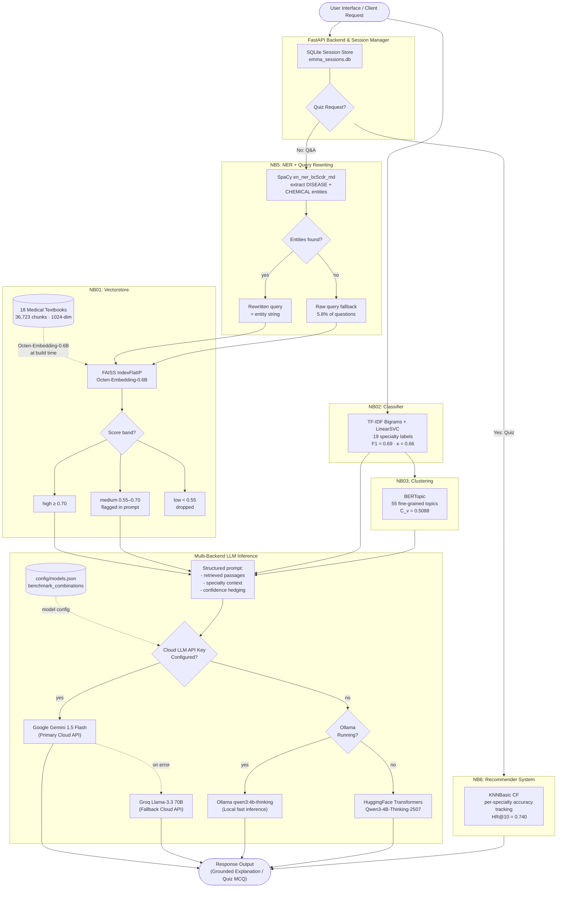
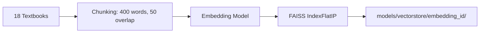

# EMMA: Emergency Medicine Mentoring Agent

## Collaborators

| Member              | Email                 | GitHub          |
| ------------------- | --------------------- | --------------- |
| Jaxen Anirban Dutta | <adutt042@uottawa.ca> | [jaxendutta](https://github.com/jaxendutta) |
| Acassia Arnaud      | <aarna035@uottawa.ca> | [acassiaarnaud](https://github.com/acassiaarnaud) |
| Yifei Yu            | <yyu039@uottawa.ca>   | [yifeiyu](https://github.com/yifeiyu) |

## Overview

EMMA is a conversational medical study and mentoring agent designed for emergency medicine review and USMLE preparation. Grounded in 18 standard medical textbooks (36,723 text chunks), EMMA operates across multiple complementary modes:

- **Explanation & Q&A Mode:** Students pose open-domain clinical questions in natural language and receive grounded responses retrieved from authoritative medical textbooks.
- **Quiz Mode:** EMMA presents authentic USMLE-style diagnostic questions from MedQA and MedMCQA, evaluates student selections, tracks specialty-wise mastery, and delivers detailed explanations.
- **Recommender System:** A collaborative filtering engine tracks performance across 19 medical specialties and steers students toward their weakest knowledge domains.
- **Interactive Web Client:** A web interface featuring a conversational chat agent with live KaTeX LaTeX rendering, an interactive D3/SVG Medical Ontology Knowledge Graph visualization, and built-in documentation.
- **Multi-Backend LLM Inference:** Seamless support for high-speed Cloud LLMs (**Google Gemini 1.5 Flash** primary, **Groq Llama 3.3 70B** fallback) for zero-GPU instant inference, as well as local **Ollama** (`qwen3:4b-thinking`) and **HuggingFace Transformers** (`Qwen3-4B-Thinking-2507`).

**Live Client:** [emma.anirban.ca](https://emma.anirban.ca)

## Contents

- [EMMA: Emergency Medicine Mentoring Agent](#emma-emergency-medicine-mentoring-agent)
  - [Collaborators](#collaborators)
  - [Overview](#overview)
  - [Contents](#contents)
  - [1. Architecture Pipeline](#1-architecture-pipeline)
  - [2. Notebooks](#2-notebooks)
  - [3. Data](#3-data)
  - [4. Vectorstore](#4-vectorstore)
    - [4.1. Relevant Files](#41-relevant-files)
    - [4.2. Getting `vectorstore` Files](#42-getting-vectorstore-files)
    - [4.3. Retrieval Quality](#43-retrieval-quality)
  - [5. NER \& Query Rewriting](#5-ner--query-rewriting)
    - [5.1. Relevant Files](#51-relevant-files)
    - [5.2. NER Model](#52-ner-model)
      - [5.2.1. Model](#521-model)
      - [5.2.2. Labels](#522-labels)
      - [5.2.3. Install](#523-install)
      - [5.2.4. Corpus Statistics (MedQA train, 10,178 questions)](#524-corpus-statistics-medqa-train-10178-questions)
      - [5.2.5. NER Rewriting Impact on FAISS Retrieval Score](#525-ner-rewriting-impact-on-faiss-retrieval-score)
  - [6. Classification](#6-classification)
    - [6.1. Relevant Files](#61-relevant-files)
    - [6.2. Task](#62-task)
    - [6.3. Champion: TF-IDF Bigrams + LinearSVC](#63-champion-tf-idf-bigrams--linearsvc)
  - [7. Clustering](#7-clustering)
    - [7.1. Relevant Files](#71-relevant-files)
    - [7.2. Method](#72-method)
    - [7.3. Interpretation of Near-Zero $\\kappa$](#73-interpretation-of-near-zero-kappa)
  - [8. Recommender System](#8-recommender-system)
    - [8.1. Relevant Files](#81-relevant-files)
    - [8.2. Task](#82-task)
    - [8.3. Algorithms Evaluated](#83-algorithms-evaluated)
    - [8.4. Champion: KNNBasic](#84-champion-knnbasic)
  - [9. RAG Pipeline \& Benchmarks](#9-rag-pipeline--benchmarks)
    - [9.1. Relevant Files](#91-relevant-files)
    - [9.2. Benchmark combinations](#92-benchmark-combinations)
    - [9.3. Finding](#93-finding)
  - [10. FastAPI Backend](#10-fastapi-backend)
    - [10.1. Relevant Files](#101-relevant-files)
    - [10.2. Endpoints](#102-endpoints)
    - [10.3. Multi-Turn Session Persistence \& Async RAG](#103-multi-turn-session-persistence--async-rag)
  - [11. Setup](#11-setup)
    - [11.1. Prerequisites](#111-prerequisites)
    - [11.2. Install](#112-install)
    - [11.3. Environment variables](#113-environment-variables)
    - [11.4. Pull the LLM (Ollama / Cloud Keys)](#114-pull-the-llm-ollama--cloud-keys)
    - [11.5. Open notebooks](#115-open-notebooks)
  - [12. Running the Server \& Web Client](#12-running-the-server--web-client)
    - [12.1. Start the Server](#121-start-the-server)
    - [12.2. Running via Docker](#122-running-via-docker)
    - [12.3. Deploying to Render / Cloud Run](#123-deploying-to-render--cloud-run)
    - [12.4. Expose to Dialogflow via ngrok](#124-expose-to-dialogflow-via-ngrok)
    - [12.5. Direct API Testing](#125-direct-api-testing)
  - [13. Key Design Decisions](#13-key-design-decisions)
  - [References](#references)

## 1. Architecture Pipeline


```mermaid
flowchart TD
    U(["User Interface / Client Request"])

    subgraph API ["FastAPI Backend & Session Manager"]
        direction TB
        S1["SQLite Session Store
        emma_sessions.db"]
        QEngine{"Quiz Request?"}
        S1 --- QEngine
    end

    subgraph NER ["NB5: NER + Query Rewriting"]
        direction TB
        N1["SpaCy en_ner_bc5cdr_md
        extract DISEASE + CHEMICAL entities"]
        N2{"Entities found?"}
        N3["Rewritten query
        = entity string"]
        N4["Raw query fallback
        5.8% of questions"]
        N1 --> N2
        N2 -->|yes| N3
        N2 -->|no| N4
    end

    subgraph VS ["NB01: Vectorstore"]
        direction TB
        TB[(18 Medical Textbooks
        36,723 chunks · 1024-dim)]
        V1["FAISS IndexFlatIP
        Octen-Embedding-0.6B"]
        V2{"Score band?"}
        V3["high ≥ 0.70"]
        V4["medium 0.55–0.70
        flagged in prompt"]
        V5["low < 0.55
        dropped"]
        TB -.->|"Octen-Embedding-0.6B
        at build time"| V1
        V1 --> V2
        V2 --> V3
        V2 --> V4
        V2 --> V5
    end

    subgraph CLS ["NB02: Classifier"]
        C1["TF-IDF Bigrams + LinearSVC
        19 specialty labels
        F1 = 0.69 · κ = 0.66"]
    end
  
    subgraph CLU ["NB03: Clustering"]
        K1["BERTopic
        55 fine-grained topics
        C_v = 0.5088"]
    end

    subgraph LLM ["Multi-Backend LLM Inference"]
        direction TB
        MC[(config/models.json
        benchmark_combinations)]
        L4["Structured prompt:
        - retrieved passages
        - specialty context
        - confidence hedging"]
        P1{"Cloud LLM API Key
        Configured?"}
        P2["Google Gemini 1.5 Flash
        (Primary Cloud API)"]
        P3["Groq Llama-3.3 70B
        (Fallback Cloud API)"]
        P4{"Ollama
        Running?"}
        P5["Ollama qwen3:4b-thinking
        (Local fast inference)"]
        P6["HuggingFace Transformers
        Qwen3-4B-Thinking-2507"]

        MC -.->|model config| P1
        L4 --> P1
        P1 -->|yes| P2
        P2 -.->|on error| P3
        P1 -->|no| P4
        P4 -->|yes| P5
        P4 -->|no| P6
    end

    subgraph CRS ["NB6: Recommender System"]
        R1["KNNBasic CF
        per-specialty accuracy tracking
        HR@10 = 0.740"]
    end

    A(["Response Output
    (Grounded Explanation / Quiz MCQ)"])

    U --> API
    QEngine -->|No: Q&A| N1
    QEngine -->|Yes: Quiz| CRS
    N3 --> V1
    N4 --> V1
    U --> C1
    C1 --> CLU
    V3 --> L4
    V4 --> L4
    C1 --> L4
    CLU --> L4
    P2 --> A
    P3 --> A
    P5 --> A
    P6 --> A
    CRS --> A
```

Clinical vignettes score lower in raw FAISS retrieval because incidental language ("A 45-year-old man presents with...") dilutes the embedding. NER rewriting isolates the `DISEASE` and `CHEMICAL` tokens before querying, improving retrieval scores by +0.005–0.006 on biomedical embeddings.

## 2. Notebooks

| #   | Notebook                        | Purpose                                                                  | Runs on        |
| --- | ------------------------------- | ------------------------------------------------------------------------ | -------------- |
| 0   | `00_data_exploration.ipynb`     | Dataset EDA: textbook sizes, MedQA/MedMCQA distributions                 | Local          |
| 1   | `01_vectorstore_build.ipynb`    | Chunk textbooks → embed → build FAISS index                              | Colab T4       |
| 2   | `02_classification.ipynb`       | Feature × classifier grid on MedMCQA, champion selection                 | Local or Colab |
| 3   | `03_clustering.ipynb`           | BERTopic + GMM + Spectral on MedQA questions                             | Local or Colab |
| 4   | `04_rag_pipeline.ipynb`         | End-to-end RAG pilot: NER → FAISS → LLM (50 questions)                   | **Colab T4**   |
| 5   | `05_ner.ipynb`                  | NER corpus analysis, collocation, retrieval score comparison             | Local          |
| 6   | `06_crs.ipynb`                  | Collaborative filtering recommender (SVD, NMF, KNNBasic)                 | Local          |
| 7   | `07_evaluation_benchmark.ipynb` | Full ablation grid: 6 combinations of embeddings × LLMs × RAG conditions | Colab T4       |

All notebooks auto-detect Google Colab and load artifacts from Google Drive. They resume from checkpoints if the session is interrupted.

## 3. Data

Three main data sources are committed or downloaded to `data/`:

| #   | Dataset                                        | Questions             | Purpose                                    |
| --- | ---------------------------------------------- | --------------------- | ------------------------------------------ |
| 1   | [MedQA-USMLE](https://github.com/jind11/MedQA) | 12,723 (train 10,178) | RAG evaluation, clustering, NER analysis   |
| 2   | [MedMCQA](https://github.com/MedMCQA/MedMCQA)  | 179,777               | Classifier training (has specialty labels) |
| 3   | 18 medical textbooks                           | 36,723 chunks         | RAG retrieval corpus                       |

MedMCQA is used for classifier training. Its `subject_name` labels provide the specialty ground truth that MedQA lacks. The textbooks were authored by experts in the same fields as the MedQA questions, establishing them as an optimal retrieval source.

```python
from src.data import load_medqa, load_medmcqa, load_all_textbooks
df    = load_medqa(split='train')   # 10,178 rows
books = load_all_textbooks()        # dict of 18 textbooks
```

## 4. Vectorstore

### 4.1. Relevant Files

| #   | File                                   | Purpose                 |
| --- | -------------------------------------- | ----------------------- |
| 1   | `src/vectorstore.py`                   | Build + query functions |
| 2   | `notebooks/01_vectorstore_build.ipynb` | Run once on Colab T4    |


```mermaid
graph LR
    A[18 Textbooks] --> B[Chunking: 400 words, 50 overlap]
    B --> C[Embedding Model]
    C --> D[FAISS IndexFlatIP]
    D --> E[models/vectorstore/embedding_id/]
```

Three vectorstores were built and evaluated (one per embedding model):

| #   | Embedding            | Dim  | RTEB Healthcare Rank | Production Default        |
| --- | -------------------- | ---- | -------------------- | ------------------------- |
| 1   | Octen-Embedding-0.6B | 1024 | #15                  | No (best ablation result) |
| 2   | Qwen3-Embedding-0.6B | 1024 | #177                 | Yes (build default)       |
| 3   | all-MiniLM-L12-v2    | 384  | —                    | No                        |

### 4.2. Getting `vectorstore` Files

The index files are excluded from git (~143 MB each). You can obtain them in three ways:

1. **Download pre-built:** Use the auto-download cell in NB01 Section 4 (pulls from shared Google Drive).
2. **Rebuild on Colab:** Run `01_vectorstore_build.ipynb` on a T4 GPU (~45 min per embedding model).
3. **Local rebuild:** Run `01_vectorstore_build.ipynb` locally if a GPU with ≥8GB VRAM is available.

Place files under `models/vectorstore/<embedding_id>/`:

```plain
models/vectorstore/
  octen-embedding-0.6b/
    index.faiss
    texts.pkl
    metadata.pkl
    config.json
```

### 4.3. Retrieval Quality

| #   | Query Type                                         | Score Range | Confidence Band |
| --- | -------------------------------------------------- | ----------- | --------------- |
| 1   | Direct question (e.g., "anaphylaxis mechanism")    | 0.72–0.73   | High            |
| 2   | Direct question (e.g., "beta blocker side effects")| 0.72–0.73   | High            |
| 3   | Raw clinical vignette                              | 0.63–0.66   | Medium          |
| 4   | NER-rewritten vignette (Octen)                     | 0.65–0.66   | Medium          |

## 5. NER & Query Rewriting

### 5.1. Relevant Files

| #   | File                     | Purpose                                                                          |
| --- | ------------------------ | -------------------------------------------------------------------------------- |
| 1   | `src/retrieval.py`       | `NER_MODEL`, `ENTITY_LABELS`, `extract_entities()`, `rewrite_query()` functions  |
| 2   | `notebooks/05_ner.ipynb` | NER corpus analysis and retrieval score validation                               |

### 5.2. NER Model

#### 5.2.1. Model

`en_ner_bc5cdr_md` (BC5CDR corpus, 1,500 PubMed articles)

#### 5.2.2. Labels

- `DISEASE`
- `CHEMICAL`

> [!NOTE]
> **Why not `en_core_sci_md`?**
> That model outputs a single generic `ENTITY` label and cannot distinguish between diseases and chemicals. `en_ner_bc5cdr_md` is the only ScispaCy model that produces typed biomedical entities suitable for query rewriting.

#### 5.2.3. Install

```bash
# Installed automatically by `uv sync` or setup scripts.
# Manual installation command:
pip install https://s3-us-west-2.amazonaws.com/ai2-s2-scispacy/releases/v0.5.4/en_ner_bc5cdr_md-0.5.4.tar.gz
```

#### 5.2.4. Corpus Statistics (MedQA train, 10,178 questions)

- 54,256 total entities extracted
- `DISEASE`: 39,575 | `CHEMICAL`: 14,681
- Mean 5.33 entities per question
- 593 questions (5.8%) have zero entities → fallback to raw query

#### 5.2.5. NER Rewriting Impact on FAISS Retrieval Score

| #   | Embedding            | Raw Vignette | NER Rewrite | Delta  |
| --- | -------------------- | ------------ | ----------- | ------ |
| 1   | all-MiniLM-L12-v2    | 0.5412       | 0.5191      | -0.022 |
| 2   | Qwen3-Embedding-0.6B | 0.6379       | 0.6431      | +0.005 |
| 3   | Octen-Embedding-0.6B | 0.6525       | 0.6584      | +0.006 |

## 6. Classification

### 6.1. Relevant Files

| #   | File                                  | Purpose                                   |
| --- | ------------------------------------- | ----------------------------------------- |
| 1   | `src/classify.py`                     | Feature pipelines, CV, training           |
| 2   | `notebooks/02_classification.ipynb`   | Full feature × classifier grid            |
| 3   | `models/classifier/tfidf_svm.pkl`     | Fitted champion pipeline (TF-IDF + SVM)   |
| 4   | `models/classifier/label_encoder.pkl` | Fitted LabelEncoder for specialty classes |

### 6.2. Task

19-class specialty prediction on MedMCQA questions, routing each query to the corresponding specialty context at inference time.

### 6.3. Champion: TF-IDF Bigrams + LinearSVC

| #   | Metric      | 10-fold CV (20k sample) | Holdout (full 179k) |
| --- | ----------- | ----------------------- | ------------------- |
| 1   | Weighted F1 | 0.5424 ± 0.0086         | 0.69                |
| 2   | Cohen's κ   | 0.5089 ± 0.0096         | 0.66                |

## 7. Clustering

### 7.1. Relevant Files

| #   | File                            | Purpose                        |
| --- | ------------------------------- | ------------------------------ |
| 1   | `src/cluster.py`                | BERTopic evaluation helpers    |
| 2   | `notebooks/03_clustering.ipynb` | Clustering analysis and models |

### 7.2. Method

BERTopic (`all-MiniLM-L12-v2` embeddings → UMAP → HDBSCAN) auto-discovers K=55 topics.

| #   | Method                | Cohen's $\kappa$ | Silhouette | $C_v$ Coherence |
| --- | --------------------- | ---------------: | ---------: | --------------: |
| 1   | TF-IDF + GMM          |           0.0193 |          — |               — |
| 2   | Embeddings + Spectral |           0.0192 |     0.0605 |               — |
| 3   | BERTopic              |          -0.0117 |      0.069 |          0.5088 |

### 7.3. Interpretation of Near-Zero $\kappa$

BERTopic discovers 55 fine-grained topic groups that do not map 1-to-1 with 19 specialty labels. This reflects granularity mismatch rather than model failure. $C_v = 0.5088$ confirms internal topic coherence.

## 8. Recommender System

### 8.1. Relevant Files

| #   | File                     | Purpose                        |
| --- | ------------------------ | ------------------------------ |
| 1   | `notebooks/06_crs.ipynb` | Recommender system development |
| 2   | `models/recommender/`    | Ratings, results, and config   |
| 3   | `models/quiz/`           | Quiz session logs and tracking |

### 8.2. Task

Recommend target specialties for student review based on their past quiz performance.

### 8.3. Algorithms Evaluated

| #   | Algorithm       | Type                            |
| --- | --------------- | ------------------------------- |
| 1   | SVD             | Matrix factorization            |
| 2   | NMF             | Matrix factorization            |
| 3   | KNNBasic        | Memory-based collaborative filter|
| 4   | NormalPredictor | Baseline (predicts mean rating) |

### 8.4. Champion: KNNBasic

| #   | Metric           | KNNBasic | NormalPredictor |
| --- | ---------------- | -------: | --------------: |
| 1   | RMSE (5-fold CV) |   0.2208 |          0.3109 |
| 2   | Hit Rate @ 5     |   0.3350 |               — |
| 3   | Hit Rate @ 10    |   0.7400 |               — |

## 9. RAG Pipeline & Benchmarks

### 9.1. Relevant Files

| #   | File                                      | Purpose                                               |
| --- | ----------------------------------------- | ----------------------------------------------------- |
| 1   | `notebooks/04_rag_pipeline.ipynb`         | RAG pilot run                                         |
| 2   | `notebooks/07_evaluation_benchmark.ipynb` | Full ablation grid                                    |
| 3   | `models/benchmarks.json`                  | Benchmark run results                                 |
| 4   | `config/models.json`                      | `benchmark_combinations` array defining the test grid|

### 9.2. Benchmark Combinations

| #     | Embedding Model          | LLM                   | RAG   | n_eval  | Accuracy | Delta     |
| ----- | ------------------------ | --------------------- | ----- | ------- | -------- | --------- |
| 1     | Qwen3-Embedding-0.6B     | Qwen3-4B              | ✗     | 50      | 42%      | —         |
| 2     | Qwen3-Embedding-0.6B     | Qwen3-4B              | ✓     | 50      | 38%      | -4pp      |
| 3     | Qwen3-Embedding-0.6B     | Qwen3-4B-Thinking     | ✗     | 100     | 31%      | —         |
| 4     | Qwen3-Embedding-0.6B     | Qwen3-4B-Thinking     | ✓     | 100     | 32%      | +1pp      |
| 5     | Octen-Embedding-0.6B     | Qwen3-4B-Thinking     | ✗     | 100     | 33%      | —         |
| **6** | **Octen-Embedding-0.6B** | **Qwen3-4B-Thinking** | **✓** | **100** | **44%**  | **+11pp** |

### 9.3. Finding

RAG effectiveness depends significantly on both embedding and LLM choice. A biomedical embedding (Octen, RTEB Healthcare rank #15) paired with a reasoning-focused LLM (Qwen3-4B-Thinking or Cloud Gemini/Groq) yields an **11 percentage point improvement**.

## 10. FastAPI Backend

### 10.1. Relevant Files

| #   | File         | Purpose                                              |
| --- | ------------ | ---------------------------------------------------- |
| 1   | `src/api.py` | FastAPI application with RAG, Chat, Quiz, and CORS   |
| 2   | `run_api.py` | Unified dev server for API and static web frontend   |

### 10.2. Endpoints

| #   | Method | Path          | Description                                                                  |
| --- | ------ | ------------- | ---------------------------------------------------------------------------- |
| 1   | GET    | `/health`     | Service health, active LLM provider (Gemini/Groq/Ollama/HF), and feature flags|
| 2   | POST   | `/chat`       | Primary web widget endpoint (RAG generation, multi-turn chat, quiz sessions) |
| 3   | POST   | `/webhook`    | Dialogflow ES webhook supporting two-turn async RAG                         |
| 4   | POST   | `/query`      | Direct RAG query endpoint for developers and automated benchmarking          |
| 5   | GET    | `/conditions` | Metadata listing of supported core emergency medical conditions              |

### 10.3. Multi-Turn Session Persistence & Async RAG

- **SQLite Session Persistence:** `src/api.py` manages an `emma_sessions.db` SQLite database to store conversation history and active quiz state across user sessions.
- **Two-Turn Async Pattern for Dialogflow:** For Dialogflow ES (which enforces a 5-second deadline), the `/webhook` endpoint immediately returns an acknowledgment ("Looking that up...") and executes RAG asynchronously in a background thread pool. The response is delivered on the next user turn.

## 11. Setup

### 11.1. Prerequisites

- Python 3.11+
- [uv](https://docs.astral.sh/uv/) (`curl -LsSf https://astral.sh/uv/install.sh | sh`)
- **Cloud API Key** (Google Gemini or Groq) for high-speed zero-GPU inference, OR [Ollama](https://ollama.com) for local LLMs.

### 11.2. Install

```bash
git clone https://github.com/jaxendutta/emma.git
cd emma

# Unix / WSL
bash scripts/setup.sh

# Windows PowerShell
scripts\setup.ps1
```

The setup script creates `.venv`, installs dependencies via `uv sync`, downloads required SpaCy models (`en_ner_bc5cdr_md`), and registers the Jupyter kernel.

### 11.3. Environment Variables

Copy `.env.example` to `.env` and configure your settings:

```bash
cp .env.example .env
```

```env
# Cloud LLM / RAG Configuration
EMMA_USE_RAG=true
GEMINI_API_KEY=your_gemini_api_key_here   # Google AI Studio free key
GROQ_API_KEY=your_groq_api_key_here       # Groq Console free key (fallback)

# Local LLM (Optional)
OLLAMA_BASE_URL=http://localhost:11434
HF_TOKEN=your_hf_token_here
```

### 11.4. Pull the LLM (Ollama / Cloud Keys)

If using Ollama locally:
```bash
ollama pull qwen3:4b-thinking-2507-q4_K_M
```
If `GEMINI_API_KEY` or `GROQ_API_KEY` is provided in `.env`, EMMA automatically routes queries to Cloud API inference with zero model loading delay.

### 11.5. Open Notebooks

```bash
uv run jupyter notebook notebooks/
```

## 12. Running the Server & Web Client

### 12.1. Start the Server

```bash
# Start API on port 8080 and static Web Client on port 8001:
uv run python run_api.py --rag
```

Open `http://localhost:8001/?tab=home` in your browser to interact with the EMMA agent interface, view documentation, or explore the Medical Ontology Knowledge Graph.

### 12.2. Running via Docker

Build and containerize the FastAPI service using Docker:

```bash
# Build Docker image
docker build -t emma .

# Run Docker container with Cloud RAG enabled
docker run -p 8080:8080 -e EMMA_USE_RAG=true -e GEMINI_API_KEY=your_key_here emma
```

### 12.3. Deploying to Render / Cloud Run

The repository includes a production-ready `render.yaml` manifest and `Dockerfile`:
- Health check path: `/health`
- Internal port: `8080`
- Environment variables: `EMMA_USE_RAG=true`, `GEMINI_API_KEY` (configured in platform dashboard)

### 12.4. Expose to Dialogflow via ngrok

```bash
ngrok http 8080
```
Update your Dialogflow ES webhook fulfillment URL to `https://<ngrok-id>.ngrok-free.app/webhook`.

### 12.5. Direct API Testing

```bash
curl -X POST http://localhost:8080/query \
  -H "Content-Type: application/json" \
  -d '{"query": "What is the first-line treatment for acute anaphylaxis?", "think": false}'
```

## 13. Key Design Decisions

| #   | Decision                                     | Rationale                                                                                                                                                                    |
| --- | -------------------------------------------- | ---------------------------------------------------------------------------------------------------------------------------------------------------------------------------- |
| 1   | Textbooks as RAG corpus                      | MedQA questions were derived from these 18 textbooks — making them the primary retrieval authority.                                                                           |
| 2   | `en_ner_bc5cdr_md` for NER                   | Only ScispaCy model providing distinct `DISEASE` + `CHEMICAL` entity labels.                                                                                                |
| 3   | Octen-Embedding-0.6B for production RAG      | Ranked #15 on RTEB Healthcare leaderboard, yielding an +11pp gain in ablation testing.                                                                                        |
| 4   | Cloud API Fallback Hierarchy (Gemini → Groq) | Google Gemini API (primary) and Groq API (fallback) provide sub-second inference with zero local GPU requirements. Ollama and HuggingFace act as local fallbacks.              |
| 5   | Persistent SQLite Session Storage            | Stores conversation history and active quiz state across user interactions.                                                                                                  |
| 6   | Web Client with KaTeX & Interactive Ontology | Single-page client (`client/`) featuring markdown rendering, KaTeX math formatting, and an SVG/D3 medical knowledge graph.                                                  |
| 7   | Two-turn async webhook                       | Resolves Dialogflow ES 5-second deadline constraints while delivering textbook-grounded answers.                                                                             |

## References

1. Rezaei, M. R., Saadati Fard, R., Parker, J. L., Krishnan, R. G., & Lankarany, M. (2025). Agentic Medical Knowledge Graphs Enhance Medical Question Answering: Bridging the Gap Between LLMs and Evolving Medical Knowledge. In *Findings of the Association for Computational Linguistics: EMNLP 2025* (pp. 12682–12701). ACL.
2. Neumann, M., King, D., Beltagy, I., & Ammar, W. (2019). ScispaCy: Fast and robust models for biomedical natural language processing. In *Proceedings of the 18th BioNLP Workshop* (pp. 319–327). ACL.
